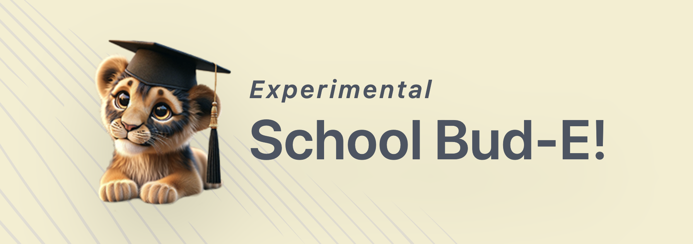

# School Bud-E 🎓🤖



Welcome to School Bud-E, your AI-powered educational assistant! 🚀

[](https://discord.gg/xBPBXfcFHd)

## 🌟 Overview

School Bud-E is an intelligent and empathetic learning assistant designed to revolutionize the educational experience. Developed by [LAION](https://laion.ai) in collaboration with the ELLIS Institute Tübingen, Collabora, the Tübingen AI Center and the DFKI, School Bud-E focuses on empathy, natural interaction, and personalized learning.

## 🚀 Features (WIP)

- 💬 Real-time responses to student queries
- 🧠 Emotionally intelligent interactions
- 🔄 Continuous conversation context
- 👥 Multi-speaker and multi-language support
- 🖥️ Local operation on consumer-grade hardware
- 🔒 Privacy-focused design

## 🛠️ Technology Stack

- **Frontend**: Fresh framework (Preact-based)
- **Styling**: Tailwind CSS
- **Language Support**: Internationalization for English and German
- **AI Models**:
  - Speech-to-Text: Whisper Large V3 (via Groq API)
  - Large Language Model: GPT-4o or equivalent

## 🏗️ Project Structure

- `routes/`: Application routes
- `components/`: Reusable UI components
- `islands/`: Interactive components (Fresh islands)
- `internalization/`: Language-specific content
- `static/`: Static assets

## 🚀 Getting Started

1. Clone the repository:

   ```bash
   git clone https://github.com/LAION-AI/school-bud-e.git
   ```

2. Install dependencies:

   ```bash
   deno task start
   ```

3. Set up environment variables:
   - Copy `.example.env` to `.env`
   - Fill in the required API keys and endpoints

4. Run the development server:

   ```bash
   deno task start
   ```

5. Open `http://localhost:8000` in your browser

## 🤝 Contributing

We welcome contributions to School Bud-E! Please join our [Discord server](https://discord.com/invite/eq3cAMZtCC) or contact us at <contact@laion.ai> to get involved.

## 🚧 Experimental Demo Version

Please note that this is an early prototype application that may provide inaccurate answers or generate content that is not suitable for all audiences. We advise caution and encourage you to report any issues you encounter to us.

## 📄 License

This project is licensed under the MIT License. See the [LICENSE](LICENSE) file for details.

## 🙏 Acknowledgements

Special thanks to LAION, ELLIS Institute Tübingen, Collabora, the Tübingen AI Center and the German Research Center for Artificial Intelligence (DFKI) for their contributions and support to this project.

---

Built with ❤️ for the future of education.
